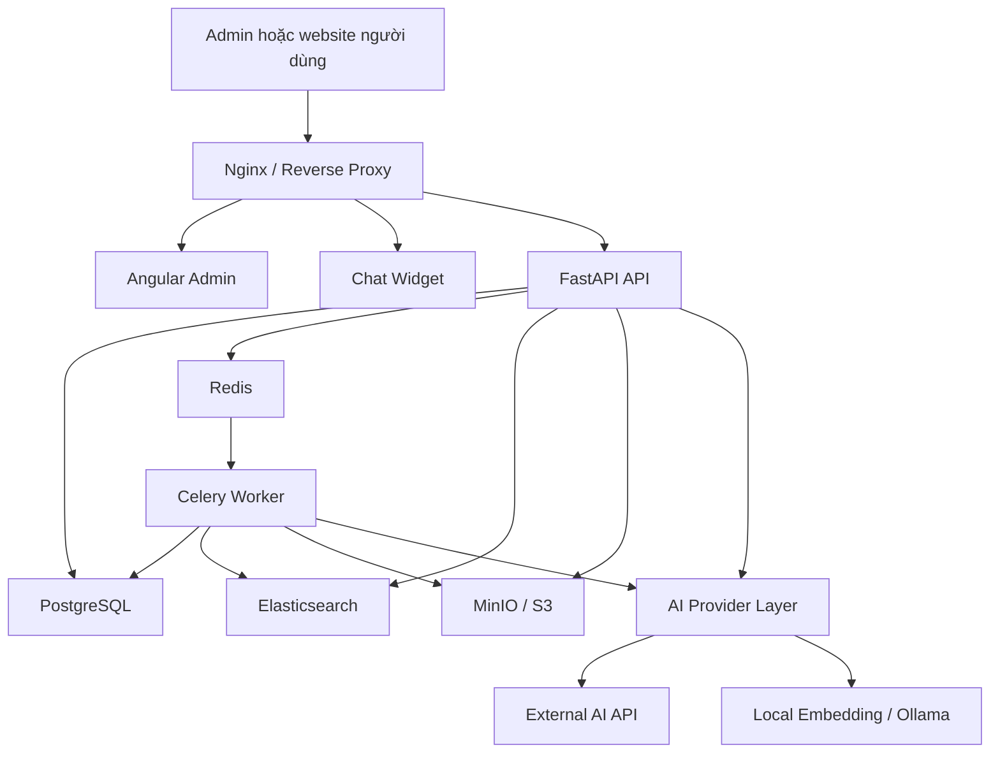
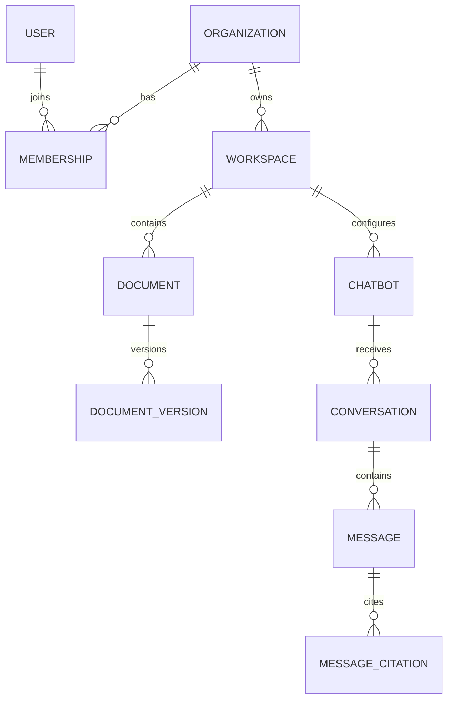
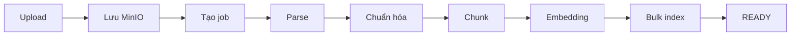
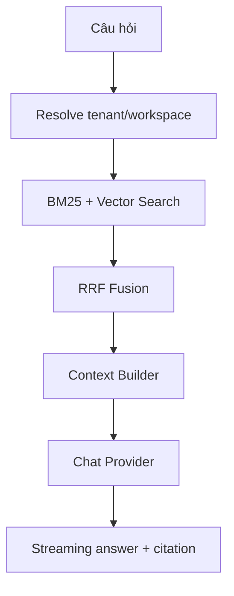

# RAGHUB — KẾ HOẠCH TRIỂN KHAI VÀ THIẾT KẾ HỆ THỐNG

> **Phiên bản:** 1.0  
> **Ngày lập:** 17/09/2026  
> **Mốc hoàn thành MVP:** 08/10/2026  
> **Mô hình sản phẩm:** Nền tảng RAG Chatbot đa miền, đa tổ chức, hỗ trợ SaaS và On-premise

---

## 1. Mục đích tài liệu

Tài liệu mô tả kế hoạch triển khai và thiết kế kỹ thuật cho RagHub — nền tảng cho phép tổ chức tự tạo miền tri thức, tải tài liệu, cấu hình mô hình AI, xây dựng chatbot RAG và nhúng chatbot vào website.

Tài liệu được sử dụng để:

- Thống nhất phạm vi MVP đến ngày 08/10/2026.
- Xác định kiến trúc, công nghệ nền và ranh giới các module.
- Làm cơ sở tạo Epic, User Story và Task trên Jira/Kanban.
- Hướng dẫn xây dựng cơ sở dữ liệu, API, RAG pipeline và Chat Widget.
- Xác định tiêu chí kiểm thử, nghiệm thu và các rủi ro kỹ thuật.

---

## 2. Mục tiêu hệ thống

RagHub giải quyết nhu cầu xây dựng chatbot hỏi đáp trên dữ liệu riêng mà người dùng không phải tự phát triển toàn bộ hạ tầng RAG.

MVP phải cho phép người dùng thực hiện luồng hoàn chỉnh:

1. Đăng ký và đăng nhập.
2. Tạo tổ chức và workspace tri thức.
3. Tải tài liệu lên hệ thống.
4. Theo dõi quá trình parse, chunk, embedding và index.
5. Cấu hình AI Provider cho Embedding và LLM.
6. Tạo chatbot dựa trên workspace.
7. Đặt câu hỏi và nhận câu trả lời có trích dẫn nguồn.
8. Sinh mã script để nhúng chatbot vào website mẫu.
9. Kiểm soát website được phép sử dụng chatbot bằng Allowed Origins.
10. Giới hạn tần suất và số request đồng thời nhằm chống lạm dụng.

### 2.1. Tiêu chí thành công của MVP

- Một tài khoản có thể tạo và quản lý nhiều workspace.
- Tài liệu được xử lý bất đồng bộ, có trạng thái rõ ràng và có thể thử lại khi lỗi.
- Kết quả truy xuất không bị lẫn dữ liệu giữa các workspace.
- Chatbot trả lời dựa trên context đã truy xuất và kèm nguồn tài liệu.
- Có ít nhất một cấu hình External AI và một cấu hình Local AI chạy được.
- Widget hoạt động trên website mẫu chỉ bằng một đoạn script.
- Toàn bộ hệ thống có thể khởi động bằng Docker Compose.

---

## 3. Phạm vi MVP

### 3.1. Chức năng bắt buộc

| Nhóm | Chức năng |
|---|---|
| Tài khoản | Đăng ký, đăng nhập, refresh token, đăng xuất, xem hồ sơ |
| Tổ chức | Tạo tổ chức, quản lý thành viên và vai trò cơ bản |
| Workspace | Tạo, sửa, xóa mềm và xem workspace |
| Tài liệu | Upload, danh sách, trạng thái xử lý, xóa và re-index |
| Ingestion | Parse, chuẩn hóa, chunk, embedding và index Elasticsearch |
| Retrieval | Kết hợp BM25 và Vector Search, lọc theo tenant/workspace |
| AI Provider | External API tương thích OpenAI và Local qua Ollama/sentence-transformers |
| Chatbot | Tạo chatbot, prompt, model, tham số retrieval và trạng thái publish |
| Chat | Streaming câu trả lời, lưu hội thoại và citation |
| Widget | Nhúng bằng script, mở/đóng chat, hiển thị citation |
| Bảo mật | JWT, RBAC, Allowed Origins, API Key, Rate Limiting |
| Triển khai | Docker Compose cho môi trường phát triển và demo |

### 3.2. Ngoài phạm vi MVP

- OCR cho PDF scan hoặc ảnh.
- Fine-tuning mô hình.
- AI Agent, tool calling hoặc workflow nhiều agent.
- Reranker chuyên dụng.
- SSO, SAML hoặc đăng nhập mạng xã hội.
- Billing, subscription và thanh toán.
- Kubernetes và kiến trúc microservices đầy đủ.
- Dashboard phân tích nâng cao.
- Đồng bộ tự động từ Google Drive, SharePoint hoặc website crawler.
- Cam kết High Availability hoặc Disaster Recovery cấp production.

---

## 4. Nguyên tắc thiết kế

1. **Modular Monolith trước:** phân tách rõ module trong source code nhưng chưa tách thành nhiều service độc lập.
2. **Xử lý tác vụ nặng bất đồng bộ:** parse, embedding và indexing chạy ở worker, không giữ HTTP request chờ lâu.
3. **PostgreSQL là nguồn dữ liệu nghiệp vụ chính:** Elasticsearch là search index có thể tái tạo.
4. **Tenant isolation bắt buộc:** mọi dữ liệu nghiệp vụ và truy vấn retrieval phải có phạm vi tenant/workspace.
5. **AI Provider độc lập:** Embedding Provider và Chat Provider có thể cấu hình riêng.
6. **Thiết kế cho khả năng thay thế:** có interface giữa nghiệp vụ với Elasticsearch, MinIO và AI Provider.
7. **MVP có thể vận hành trên một máy:** các thành phần được đóng gói bằng Docker Compose.
8. **Không đưa secret xuống trình duyệt:** API key của nhà cung cấp AI chỉ tồn tại ở backend.
9. **Có khả năng quan sát:** request, ingestion job, lỗi provider và usage phải có log/metric cơ bản.

---

## 5. Kiến trúc tổng thể



### 5.1. Kiểu kiến trúc

Hệ thống sử dụng **Modular Monolith kết hợp Background Worker**:

- `raghub-api`: REST API, Authentication, Chat API và SSE.
- `raghub-worker`: xử lý tài liệu bất đồng bộ.
- API và Worker dùng chung domain model, repository và infrastructure adapter.
- Khi lưu lượng tăng, worker ingestion hoặc AI gateway có thể được tách thành service riêng mà không phải viết lại nghiệp vụ.

### 5.2. Ranh giới lưu trữ

| Thành phần | Dữ liệu lưu trữ |
|---|---|
| PostgreSQL | User, tenant, workspace, document metadata, chatbot, conversation, usage, audit |
| MinIO/S3 | File tài liệu gốc và artifact phát sinh nếu có |
| Elasticsearch | Nội dung chunk, vector, metadata phục vụ retrieval |
| Redis | Task queue, rate limit, cache ngắn hạn, concurrency counter |

---

## 6. Công nghệ nền

| Lớp | Công nghệ | Quy ước |
|---|---|---|
| Ngôn ngữ Backend | Python 3.12 | Dùng type hints và async cho I/O |
| Web Framework | FastAPI | REST API, dependency injection, OpenAPI, SSE |
| Validation | Pydantic v2 | Request/response schema và cấu hình |
| ORM | SQLAlchemy 2.x | Repository pattern, session theo request |
| Migration | Alembic | Mọi thay đổi schema phải có migration |
| Admin Frontend | Angular 21.2.x | Standalone components, Signals và RxJS |
| UI | NG-ZORRO | Table, form, modal, notification |
| Widget | TypeScript + Web Component | Shadow DOM để cô lập CSS |
| Database | PostgreSQL 17 | Dữ liệu nghiệp vụ và transaction |
| Search Engine | Elasticsearch 9.x | BM25, dense vector và filter metadata |
| Object Storage | MinIO | API tương thích S3 cho local/on-premise |
| Queue | Celery + Redis | Ingestion task, retry và concurrency |
| Local Embedding | sentence-transformers | Model đa ngôn ngữ có kích thước phù hợp |
| Local LLM | Ollama | Chạy mô hình quantized ở môi trường local |
| External AI | OpenAI-compatible API | Adapter dùng chung cho nhiều provider |
| Streaming | Server-Sent Events | Stream token một chiều từ server |
| Reverse Proxy | Nginx | TLS, routing, upload limit |
| Container | Docker + Docker Compose | Development, demo và on-premise MVP |
| Backend Test | Pytest | Unit và integration test |
| Frontend Test | Vitest/Jasmine + Playwright | Unit và end-to-end test |
| Code Quality | Ruff, mypy, ESLint, Prettier | Chạy trong CI |

### 6.1. Quy tắc quản lý phiên bản

- Khóa dependency bằng `pyproject.toml` và lock file.
- Khóa Node package bằng `package-lock.json`.
- Docker image phải khai báo version cụ thể, không dùng `latest`.
- Elasticsearch server và Python client sử dụng cùng major version.
- Thay đổi embedding model phải tạo index version mới và chạy re-index.

---

## 7. Thiết kế module Backend

### 7.1. Danh sách module

| Module | Trách nhiệm |
|---|---|
| `auth` | Đăng ký, đăng nhập, refresh, logout và password hashing |
| `users` | Hồ sơ người dùng |
| `organizations` | Tenant và thông tin tổ chức |
| `memberships` | Thành viên, role và kiểm tra quyền |
| `workspaces` | Miền tri thức độc lập |
| `documents` | Metadata, upload, version và trạng thái tài liệu |
| `ingestion` | Điều phối parse, chunk, embedding và index |
| `search` | BM25, vector search, fusion và context building |
| `ai_providers` | Interface và adapter cho AI Provider |
| `chatbots` | Cấu hình chatbot và publish settings |
| `conversations` | Phiên chat, message và citation |
| `api_keys` | Khóa tích hợp server-to-server |
| `usage` | Token usage, latency và quota |
| `audit` | Nhật ký thao tác quản trị |

### 7.2. Cấu trúc một module

```text
documents/
├── router.py          # Khai báo endpoint
├── schemas.py         # Pydantic request/response
├── service.py         # Nghiệp vụ
├── repository.py      # Truy cập dữ liệu
├── models.py          # SQLAlchemy model
├── permissions.py     # Kiểm tra quyền
└── exceptions.py      # Lỗi thuộc module
```

Luồng phụ thuộc chuẩn:

```text
Router → Service → Repository/Provider Interface → Infrastructure
```

Router không được viết trực tiếp truy vấn SQL, Elasticsearch hoặc gọi model AI.

---

## 8. Cấu trúc source code

```text
raghub/
├── apps/
│   ├── admin-web/                    # Angular Admin
│   └── chat-widget/                  # TypeScript Web Component
├── backend/
│   ├── app/
│   │   ├── core/
│   │   │   ├── config.py
│   │   │   ├── database.py
│   │   │   ├── security.py
│   │   │   ├── logging.py
│   │   │   └── exceptions.py
│   │   ├── modules/
│   │   │   ├── auth/
│   │   │   ├── users/
│   │   │   ├── organizations/
│   │   │   ├── workspaces/
│   │   │   ├── documents/
│   │   │   ├── ingestion/
│   │   │   ├── search/
│   │   │   ├── ai_providers/
│   │   │   ├── chatbots/
│   │   │   ├── conversations/
│   │   │   └── usage/
│   │   ├── infrastructure/
│   │   │   ├── elasticsearch/
│   │   │   ├── object_storage/
│   │   │   ├── redis/
│   │   │   └── task_queue/
│   │   ├── workers/
│   │   └── main.py
│   ├── alembic/
│   ├── tests/
│   ├── pyproject.toml
│   └── Dockerfile
├── infrastructure/
│   ├── nginx/
│   ├── elasticsearch/
│   ├── docker-compose.yml
│   └── docker-compose.local.yml
├── docs/
│   ├── architecture.md
│   ├── database.md
│   ├── api.md
│   └── adr/
├── scripts/
├── .env.example
└── README.md
```

---

## 9. Thiết kế mô hình dữ liệu

### 9.1. Quan hệ tổng quát



### 9.2. Các bảng chính

| Bảng | Trường quan trọng | Ghi chú |
|---|---|---|
| `users` | `id`, `email`, `password_hash`, `status` | Email unique, không lưu mật khẩu thô |
| `organizations` | `id`, `name`, `slug`, `status` | Đại diện tenant |
| `memberships` | `user_id`, `organization_id`, `role` | Unique theo user và organization |
| `workspaces` | `id`, `organization_id`, `name`, `slug` | Miền tri thức |
| `documents` | `id`, `workspace_id`, `name`, `status` | Metadata logic của tài liệu |
| `document_versions` | `id`, `document_id`, `storage_key`, `checksum`, `status` | Quản lý version và re-index |
| `ingestion_jobs` | `id`, `document_version_id`, `stage`, `progress`, `error` | Theo dõi background job |
| `provider_configs` | `id`, `organization_id`, `type`, `capability`, `encrypted_secret` | Cấu hình provider |
| `chatbots` | `id`, `workspace_id`, `name`, `system_prompt`, `public_key` | Cấu hình chatbot |
| `allowed_origins` | `id`, `chatbot_id`, `origin` | Origin đầy đủ gồm scheme và host |
| `conversations` | `id`, `chatbot_id`, `external_user_id` | Phiên chat |
| `messages` | `id`, `conversation_id`, `role`, `content`, `usage_json` | User/assistant message |
| `message_citations` | `message_id`, `chunk_id`, `rank`, `score` | Nguồn tham chiếu |
| `api_keys` | `id`, `organization_id`, `key_hash`, `prefix`, `expires_at` | Chỉ lưu hash |
| `usage_events` | `organization_id`, `provider`, `model`, `tokens`, `latency_ms` | Theo dõi sử dụng |
| `audit_logs` | `actor_id`, `action`, `resource_type`, `resource_id`, `metadata` | Theo dõi thao tác |

### 9.3. Quy tắc dữ liệu đa tenant

- Bảng thuộc phạm vi tenant phải có `organization_id` trực tiếp hoặc suy ra chắc chắn qua quan hệ cha.
- API không nhận và tin tưởng `organization_id` từ request body nếu có thể suy ra từ access token hoặc resource.
- Repository phải nhận `organization_id/workspace_id` làm điều kiện truy vấn.
- Mọi truy vấn Elasticsearch phải filter `organization_id` và `workspace_id` trước khi xếp hạng.
- ID sử dụng UUID, không dùng ID tuần tự làm khóa công khai.
- Xóa organization, workspace và document theo cơ chế soft delete trong MVP.

### 9.4. Trạng thái tài liệu

```text
UPLOADED → QUEUED → PARSING → CHUNKING → EMBEDDING → INDEXING → READY
                  ↘ FAILED
```

Các thao tác chat chỉ truy xuất chunk thuộc `document_version` đang ở trạng thái `READY`.

---

## 10. Thiết kế Elasticsearch

### 10.1. Chiến lược index

MVP sử dụng một logical index chung có version:

```text
raghub_chunks_v1
```

Alias phục vụ ứng dụng:

```text
raghub_chunks_current → raghub_chunks_v1
```

Không tạo một index cho mỗi workspace vì có thể gây tăng số shard và khó vận hành khi số tenant lớn.

### 10.2. Document chunk mẫu

```json
{
  "organization_id": "uuid",
  "workspace_id": "uuid",
  "document_id": "uuid",
  "document_version_id": "uuid",
  "chunk_id": "uuid",
  "content": "Nội dung đoạn tài liệu...",
  "embedding": [0.012, -0.031],
  "source_name": "quy-che-dao-tao.pdf",
  "page_number": 12,
  "section_title": "Điều kiện tốt nghiệp",
  "language": "vi",
  "created_at": "2026-09-17T00:00:00Z"
}
```

### 10.3. Mapping chính

| Field | Kiểu | Mục đích |
|---|---|---|
| `organization_id` | `keyword` | Tenant filter |
| `workspace_id` | `keyword` | Workspace filter |
| `document_id` | `keyword` | Filter/xóa theo tài liệu |
| `chunk_id` | `keyword` | Citation |
| `content` | `text` | BM25 search |
| `embedding` | `dense_vector` | kNN vector search |
| `source_name` | `keyword` + text subfield | Hiển thị và tìm kiếm |
| `page_number` | `integer` | Citation |

Số chiều `embedding` được xác định theo model đã chọn. Không được index vector có số chiều khác vào cùng index.

---

## 11. Document Ingestion Pipeline



### 11.1. Luồng xử lý

1. API kiểm tra quyền trên workspace.
2. Kiểm tra extension, MIME type và dung lượng file.
3. Tính SHA-256 để nhận biết file trùng.
4. Lưu file gốc vào MinIO theo key không đoán được.
5. Tạo `document`, `document_version` và `ingestion_job`.
6. Đẩy task vào Redis; API trả `202 Accepted`.
7. Worker đọc file và chọn parser tương ứng.
8. Chuẩn hóa text, giữ metadata trang/sheet/slide.
9. Chia chunk theo cấu trúc và giới hạn token.
10. Gọi Embedding Provider theo batch.
11. Bulk index vào Elasticsearch.
12. Chuyển trạng thái tài liệu thành `READY`.
13. Nếu lỗi, lưu stage, error code và cho phép retry.

### 11.2. Parser MVP

| Định dạng | Thư viện | Metadata cần giữ |
|---|---|---|
| PDF text | PyMuPDF | Trang, tiêu đề nếu xác định được |
| DOCX | python-docx | Heading, paragraph, table |
| XLSX | openpyxl | Sheet, range/row |
| PPTX | python-pptx | Slide, title |
| TXT/MD | Python standard library | Tên file, heading |

PDF scan không có text phải trả trạng thái `FAILED_UNSUPPORTED_OCR` thay vì tạo index rỗng.

### 11.3. Chiến lược chunking ban đầu

```yaml
chunking:
  target_tokens: 450
  overlap_tokens: 80
  min_tokens: 80
  preserve_headings: true
```

- Ưu tiên chia theo heading/paragraph trước khi chia theo token.
- Không nối nội dung giữa hai trang nếu làm mất thông tin citation.
- Với XLSX, mỗi chunk cần chứa tên cột để giữ ngữ nghĩa.
- Mỗi chunk phải có `chunk_id` ổn định trong một document version.

### 11.4. Tính idempotent và retry

- Task nhận `document_version_id`, không nhận toàn bộ file qua queue.
- Dùng checksum và document version để tránh index trùng.
- Trước khi re-index, tạo index batch mới hoặc xóa chunk đúng version.
- Retry tối đa 3 lần với exponential backoff cho lỗi tạm thời.
- Không retry tự động với file hỏng hoặc định dạng không hỗ trợ.

---

## 12. Retrieval và RAG Pipeline



### 12.1. Các bước xử lý câu hỏi

1. Xác thực chatbot public key/API key và kiểm tra Allowed Origin.
2. Xác định cố định `organization_id`, `workspace_id` từ chatbot.
3. Kiểm tra rate limit và số request đồng thời.
4. Sinh query embedding bằng Embedding Provider của workspace.
5. Chạy BM25 và vector search với tenant/workspace filter.
6. Kết hợp hai danh sách bằng Reciprocal Rank Fusion (RRF).
7. Chọn các chunk tốt nhất theo context budget.
8. Xây prompt gồm system instruction, context và câu hỏi.
9. Gọi Chat Provider và stream kết quả qua SSE.
10. Lưu message, usage và citation.

### 12.2. Cấu hình retrieval ban đầu

```yaml
retrieval:
  bm25_top_k: 15
  vector_top_k: 15
  final_top_k: 5
  rrf_k: 60
  max_context_tokens: 6000
  minimum_relevance_score: null
```

RRF được thực hiện ở application layer để tránh phụ thuộc vào gói tính năng hoặc license cụ thể của Elasticsearch.

### 12.3. Quy tắc tạo câu trả lời

- Chỉ trả lời dựa trên context được cung cấp.
- Nếu không đủ dữ liệu, nêu rõ không tìm thấy thông tin phù hợp.
- Không làm theo chỉ dẫn trong tài liệu nếu chỉ dẫn đó cố thay đổi system prompt.
- Citation do backend ánh xạ từ `chunk_id`, không để LLM tự tạo URL hoặc số trang.
- Không đưa secret, provider config hoặc nội dung workspace khác vào prompt.

### 12.4. Response mẫu

```json
{
  "answer": "Sinh viên phải hoàn thành đủ số tín chỉ theo chương trình đào tạo.",
  "citations": [
    {
      "document_id": "uuid",
      "document_name": "quy-che-dao-tao.pdf",
      "page": 12,
      "chunk_id": "uuid",
      "excerpt": "Sinh viên được xét tốt nghiệp khi..."
    }
  ]
}
```

---

## 13. Thiết kế AI Provider Layer

Embedding và Chat là hai capability độc lập.

```python
class EmbeddingProvider(Protocol):
    async def embed_documents(
        self, texts: list[str]
    ) -> list[list[float]]: ...

    async def embed_query(
        self, text: str
    ) -> list[float]: ...


class ChatProvider(Protocol):
    async def stream_chat(
        self,
        messages: list[ChatMessage],
        options: ChatOptions,
    ) -> AsyncIterator[str]: ...
```

### 13.1. Adapter MVP

```text
EmbeddingProvider
├── OpenAICompatibleEmbeddingProvider
└── LocalSentenceTransformerProvider

ChatProvider
├── OpenAICompatibleChatProvider
└── OllamaChatProvider
```

### 13.2. Quy tắc cấu hình

- Mỗi workspace chọn một embedding profile và một chat profile.
- Không cho đổi embedding model âm thầm khi workspace đã có dữ liệu.
- Nếu đổi embedding model/dimension, tạo re-index job và index version mới.
- API key provider phải được mã hóa trước khi lưu database.
- Response log không ghi API key hoặc Authorization header.
- Provider phải có timeout, retry giới hạn và error mapping thống nhất.

### 13.3. Cấu hình local cho máy phát triển

Với máy Intel Core i5 Gen 13, RAM 16 GB và RTX 3050 4 GB:

- Local embedding: model đa ngôn ngữ cỡ nhỏ, ví dụ họ `multilingual-e5-small`.
- Local LLM demo: Qwen 3 1.7B hoặc 4B bản quantized qua Ollama.
- Celery concurrency đặt `1` khi chạy đồng thời Elasticsearch và local model.
- External AI được ưu tiên cho demo chất lượng cao; local dùng để chứng minh khả năng on-premise.

---

## 14. Thiết kế API

Base path:

```text
/api/v1
```

### 14.1. Authentication

```http
POST /auth/register
POST /auth/login
POST /auth/refresh
POST /auth/logout
GET  /auth/me
```

### 14.2. Organizations và memberships

```http
GET    /organizations
POST   /organizations
GET    /organizations/{organization_id}
PATCH  /organizations/{organization_id}
GET    /organizations/{organization_id}/members
POST   /organizations/{organization_id}/members
PATCH  /organizations/{organization_id}/members/{user_id}
DELETE /organizations/{organization_id}/members/{user_id}
```

### 14.3. Workspaces

```http
GET    /workspaces
POST   /workspaces
GET    /workspaces/{workspace_id}
PATCH  /workspaces/{workspace_id}
DELETE /workspaces/{workspace_id}
```

### 14.4. Documents

```http
GET    /workspaces/{workspace_id}/documents
POST   /workspaces/{workspace_id}/documents
GET    /documents/{document_id}
GET    /documents/{document_id}/status
POST   /documents/{document_id}/reindex
DELETE /documents/{document_id}
```

Upload thành công trả về:

```http
HTTP/1.1 202 Accepted
```

```json
{
  "document_id": "uuid",
  "job_id": "uuid",
  "status": "QUEUED"
}
```

### 14.5. Providers

```http
GET    /organizations/{organization_id}/providers
POST   /organizations/{organization_id}/providers
PATCH  /providers/{provider_id}
POST   /providers/{provider_id}/test
DELETE /providers/{provider_id}
```

### 14.6. Chatbots

```http
GET    /workspaces/{workspace_id}/chatbots
POST   /workspaces/{workspace_id}/chatbots
GET    /chatbots/{chatbot_id}
PATCH  /chatbots/{chatbot_id}
POST   /chatbots/{chatbot_id}/publish
POST   /chatbots/{chatbot_id}/test
GET    /chatbots/{chatbot_id}/embed-code
DELETE /chatbots/{chatbot_id}
```

### 14.7. Public Chat API

```http
GET  /public/chatbots/{public_key}/config
POST /public/chatbots/{public_key}/conversations
POST /public/chatbots/{public_key}/chat
```

### 14.8. Chuẩn lỗi API

```json
{
  "error": {
    "code": "DOCUMENT_NOT_READY",
    "message": "Tài liệu chưa sẵn sàng để truy xuất.",
    "request_id": "uuid",
    "details": {}
  }
}
```

Các HTTP status chính:

| Status | Trường hợp |
|---|---|
| `200` | Truy vấn thành công |
| `201` | Tạo resource thành công |
| `202` | Đã nhận tác vụ bất đồng bộ |
| `204` | Xóa/đăng xuất thành công |
| `400` | Request không hợp lệ |
| `401` | Chưa xác thực/token không hợp lệ |
| `403` | Không đủ quyền/origin không được phép |
| `404` | Không tìm thấy resource trong tenant hiện tại |
| `409` | Trùng dữ liệu hoặc trạng thái xung đột |
| `413` | File vượt giới hạn |
| `422` | Validation error |
| `429` | Rate limit/concurrency limit |
| `500` | Lỗi hệ thống |
| `502/504` | Provider lỗi hoặc timeout |

---

## 15. Authentication, Authorization và bảo mật

### 15.1. Admin authentication

- Access token TTL 15 phút, lưu trong memory của Angular.
- Refresh token TTL 7 ngày, lưu cookie `HttpOnly`, `Secure`, `SameSite` phù hợp môi trường triển khai.
- Không lưu access/refresh token trong `localStorage` hoặc `sessionStorage`.
- Khi tải lại trang, Angular gọi `/auth/refresh` để bootstrap session.
- Các request 401 đồng thời dùng chung một refresh request.
- Mật khẩu hash bằng Argon2id hoặc bcrypt với cấu hình an toàn.

### 15.2. RBAC

| Role | Quyền chính |
|---|---|
| `OWNER` | Toàn quyền organization, provider và thành viên |
| `ADMIN` | Quản lý workspace, chatbot, provider và thành viên hạn chế |
| `EDITOR` | Quản lý tài liệu và chatbot |
| `VIEWER` | Chỉ xem dữ liệu và lịch sử được cho phép |

Backend là nơi quyết định quyền cuối cùng; việc ẩn nút ở frontend không được xem là kiểm soát truy cập.

### 15.3. Bảo mật Chat Widget

- `public_key` của chatbot là định danh công khai, không phải secret.
- Kiểm tra header `Origin` theo danh sách Allowed Origins.
- Không chấp nhận wildcard `*` cho chatbot production.
- Rate limit theo `chatbot_id + IP` và có thể bổ sung anonymous session.
- Giới hạn số request đang chạy cho mỗi chatbot/tenant.
- Chatbot nội bộ có thể yêu cầu signed user token ở giai đoạn sau.

### 15.4. Bảo vệ upload

- Kiểm tra cả extension và MIME type.
- Giới hạn dung lượng file, số trang và số sheet/slide nếu cần.
- Đổi tên object thành UUID, không dùng trực tiếp filename làm storage key.
- Chống path traversal.
- Không thực thi macro hoặc mã nhúng trong tài liệu.
- Có thể bổ sung antivirus scan sau MVP.

### 15.5. Chống lộ dữ liệu giữa tenant

- Viết integration test cố ý truy cập resource của tenant khác.
- Elasticsearch query builder tự động gắn tenant/workspace filter.
- Citation chỉ resolve từ tập chunk đã retrieval trong request hiện tại.
- Log không ghi toàn bộ tài liệu hoặc prompt chứa dữ liệu nhạy cảm mặc định.

---

## 16. Chat Widget

Widget được xây dựng bằng TypeScript dưới dạng Web Component và sử dụng Shadow DOM để cô lập style với website chủ.

### 16.1. Mã nhúng

```html
<script
  src="https://raghub.example.com/widget/raghub.js"
  data-chatbot-key="CHATBOT_PUBLIC_KEY"
  defer>
</script>
```

Script khởi tạo:

```html
<raghub-chatbot chatbot-key="CHATBOT_PUBLIC_KEY"></raghub-chatbot>
```

### 16.2. Chức năng MVP

- Nút nổi mở/đóng cửa sổ chat.
- Hiển thị lịch sử trong phiên hiện tại.
- Streaming câu trả lời.
- Hiển thị danh sách citation.
- Trạng thái đang xử lý và nút dừng stream.
- Thông báo lỗi kết nối, provider timeout và rate limit.
- Theme cơ bản: màu chính, tiêu đề và lời chào.
- Responsive trên desktop và mobile.

---

## 17. Thiết kế triển khai

### 17.1. Docker Compose services

```text
nginx
admin-web
api
worker
postgres
redis
elasticsearch
minio
ollama          # chỉ bật với profile local-ai
```

### 17.2. Deployment profiles

```bash
docker compose --profile external-ai up -d
docker compose --profile local-ai up -d
```

### 17.3. Cấu hình môi trường

Các biến cấu hình mẫu:

```dotenv
APP_ENV=development
APP_SECRET_KEY=
DATABASE_URL=postgresql+asyncpg://...
REDIS_URL=redis://redis:6379/0
ELASTICSEARCH_URL=http://elasticsearch:9200
S3_ENDPOINT=http://minio:9000
S3_ACCESS_KEY=
S3_SECRET_KEY=
S3_BUCKET=raghub-documents
JWT_PRIVATE_KEY=
JWT_PUBLIC_KEY=
ACCESS_TOKEN_TTL_MINUTES=15
REFRESH_TOKEN_TTL_DAYS=7
MAX_UPLOAD_SIZE_MB=25
OLLAMA_BASE_URL=http://ollama:11434
```

Secret thật không được commit vào Git. Repository chỉ lưu `.env.example`.

### 17.4. SaaS và On-premise

| Nội dung | SaaS | On-premise |
|---|---|---|
| Tenant | Nhiều organization | Có thể một hoặc nhiều organization |
| AI | External hoặc model tập trung | External hoặc local hoàn toàn |
| Storage | S3/MinIO tập trung | MinIO/S3 nội bộ |
| Search | Elasticsearch cluster chung có filter | Elasticsearch nội bộ |
| Triển khai MVP | Docker Compose trên server | Docker Compose trong mạng tổ chức |

Codebase giữ nguyên; khác biệt chủ yếu nằm ở cấu hình provider và hạ tầng.

---

## 18. Logging, monitoring và audit

### 18.1. Structured logging

Mỗi log nên có:

```json
{
  "timestamp": "...",
  "level": "INFO",
  "request_id": "uuid",
  "organization_id": "uuid",
  "workspace_id": "uuid",
  "module": "ingestion",
  "event": "document_indexed",
  "duration_ms": 1200
}
```

Không log:

- Password.
- JWT đầy đủ.
- Provider API key.
- Authorization header.
- Refresh token.
- Toàn bộ nội dung tài liệu theo mặc định.

### 18.2. Metric tối thiểu

- API request count, latency và error rate.
- Số ingestion job theo trạng thái.
- Thời gian parse, embedding và indexing.
- Chat latency đến token đầu tiên và tổng thời gian.
- Token usage theo tenant/provider/model.
- Số request bị rate limit.
- Provider error/timeout count.

### 18.3. Audit event tối thiểu

- Login thất bại/thành công.
- Tạo/xóa workspace.
- Upload/xóa/re-index tài liệu.
- Tạo/sửa/xóa provider config.
- Publish/unpublish chatbot.
- Thay đổi Allowed Origins và API key.

---

## 19. Chiến lược kiểm thử

### 19.1. Unit test

- Permission/RBAC rules.
- Chunking và metadata preservation.
- RRF fusion.
- Context budget.
- Provider error mapping.
- Rate-limit key generation.

### 19.2. Integration test

- PostgreSQL repository với database test.
- Upload → queue → worker → Elasticsearch.
- Xóa/re-index tài liệu.
- Refresh token rotation.
- Tenant isolation ở PostgreSQL và Elasticsearch.
- Chat response có citation hợp lệ.

### 19.3. End-to-end test

1. Đăng ký và đăng nhập.
2. Tạo workspace.
3. Upload PDF.
4. Đợi trạng thái `READY`.
5. Tạo chatbot.
6. Hỏi nội dung có trong PDF.
7. Kiểm tra câu trả lời và citation.
8. Nhúng widget vào website mẫu.
9. Kiểm tra origin hợp lệ và origin bị chặn.

### 19.4. Security test quan trọng

- User tenant A truy cập ID của tenant B phải nhận `404` hoặc `403` theo quy ước.
- Chatbot A không retrieval chunk của workspace B.
- API key đã revoke không thể sử dụng.
- Upload file giả MIME hoặc quá dung lượng bị từ chối.
- Origin không nằm trong allowlist bị từ chối.
- Rate limit trả `429` đúng thời gian reset.

---

## 20. Yêu cầu phi chức năng MVP

| Thuộc tính | Mục tiêu MVP |
|---|---|
| API latency | CRUD thông thường p95 dưới 500 ms trong môi trường demo |
| Retrieval latency | p95 dưới 2 giây, chưa tính LLM |
| Chat first token | Dưới 5 giây khi provider hoạt động bình thường |
| Upload size | Mặc định tối đa 25 MB/file, có thể cấu hình |
| Availability | Demo/on-premise đơn node, chưa cam kết HA |
| Tenant isolation | Không có truy vấn thiếu tenant/workspace scope |
| Retry | Ingestion lỗi tạm thời retry tối đa 3 lần |
| Auditability | Các thao tác quản trị quan trọng có audit log |
| Recoverability | Có thể re-index Elasticsearch từ file và PostgreSQL metadata |

---

## 21. Kế hoạch triển khai từ 17/09 đến 08/10/2026

### Giai đoạn 1 — Foundation và vertical slice (17/09–20/09)

Mục tiêu: tạo nền tảng chạy được và chứng minh luồng kỹ thuật tối thiểu.

- Khởi tạo monorepo và quy tắc branch/commit.
- Tạo Docker Compose cho PostgreSQL, Redis, Elasticsearch và MinIO.
- Tạo FastAPI base, config, health check và error format.
- Tạo Angular shell, routing và layout Admin.
- Thiết kế migration ban đầu.
- Thực hiện vertical slice: upload một PDF → worker parse → index → search thử.

**Kết quả:** hạ tầng local chạy được, có một tài liệu được index và truy vấn thành công.

### Giai đoạn 2 — Auth, tenant và quản lý tài liệu (21/09–24/09)

- Register, login, refresh, logout.
- Organization, membership, RBAC.
- CRUD workspace.
- Upload, danh sách và trạng thái tài liệu.
- MinIO adapter, checksum và ingestion job.
- Giao diện Angular cho auth, workspace và document list.

**Kết quả:** người dùng đăng nhập, tạo workspace và upload tài liệu trên giao diện.

### Giai đoạn 3 — Hoàn thiện ingestion và retrieval (25/09–28/09)

- Parser PDF, DOCX, XLSX, PPTX, TXT/MD.
- Chunking có metadata.
- Embedding batching.
- Elasticsearch mapping và bulk indexing.
- BM25, vector search và RRF.
- Re-index, retry và xử lý lỗi.
- Test tenant/workspace isolation.

**Kết quả:** tài liệu hỗ trợ được chuyển sang `READY` và hybrid retrieval trả đúng nguồn.

### Giai đoạn 4 — AI Provider và Chat API (29/09–02/10)

- Provider interface.
- External OpenAI-compatible adapter.
- Local sentence-transformers adapter.
- Ollama chat adapter.
- Chatbot config và system prompt.
- Context builder, Chat API, SSE và citation.
- Lưu conversation, messages và usage.

**Kết quả:** chatbot trả lời streaming có citation với cả cấu hình external và local tối thiểu.

### Giai đoạn 5 — Widget và kiểm soát truy cập (03/10–05/10)

- Web Component + Shadow DOM.
- Embed script và public chatbot config.
- Allowed Origins.
- Rate limit và concurrent request limit.
- Giao diện cấu hình chatbot và copy embed code.
- Website mẫu tích hợp widget.

**Kết quả:** website mẫu dùng được chatbot chỉ bằng đoạn script.

### Giai đoạn 6 — Hardening, kiểm thử và demo (06/10–08/10)

- Chạy unit, integration và E2E test chính.
- Kiểm thử tenant isolation và upload security.
- Bổ sung structured log, request ID và audit log.
- Kiểm tra Docker Compose từ môi trường sạch.
- Chuẩn bị dữ liệu demo, README và sơ đồ hệ thống.
- Sửa lỗi blocker; không bổ sung tính năng mới sau ngày 06/10.

**Kết quả:** bản MVP có thể demo, cài đặt lại và trình bày kiến trúc.

---

## 22. Backlog theo Epic

| Epic | Kết quả mong đợi | Ưu tiên |
|---|---|---|
| E01 Foundation | Repo, Docker, CI, config và health check | P0 |
| E02 Identity & Access | Auth, refresh token, organization, membership, RBAC | P0 |
| E03 Knowledge Workspace | CRUD workspace và tenant scope | P0 |
| E04 Document Management | Upload, storage, status, delete, re-index | P0 |
| E05 Ingestion Pipeline | Parse, chunk, embed và index | P0 |
| E06 Retrieval | BM25, vector, RRF và context builder | P0 |
| E07 AI Provider | External và local provider | P0 |
| E08 RAG Chat | Chatbot config, SSE, conversation và citation | P0 |
| E09 Embeddable Widget | Web Component và embed script | P0 |
| E10 Security & Quota | Allowed Origins, API key, rate/concurrency limit | P0 |
| E11 Observability | Log, usage và audit | P1 |
| E12 Testing & Demo | Automated test, sample data và tài liệu | P0 |

### 22.1. Quy tắc Kanban

Các cột đề xuất:

```text
BACKLOG → READY → IN PROGRESS → CODE REVIEW → TESTING → DONE
```

Giới hạn WIP:

- `IN PROGRESS`: tối đa 2 task/người.
- Task blocker phải ghi rõ nguyên nhân và hướng xử lý.
- Mỗi task nên hoàn thành trong 0,5–2 ngày.
- User Story chỉ chuyển `DONE` khi đạt acceptance criteria và có test phù hợp.

---

## 23. Rủi ro và phương án xử lý

| Rủi ro | Mức độ | Phương án |
|---|---|---|
| Phạm vi quá lớn so với deadline | Cao | Khóa phạm vi P0, ngừng thêm chức năng từ 06/10 |
| Máy local thiếu RAM/GPU | Cao | External AI cho demo chính; local dùng model nhỏ và worker concurrency 1 |
| Parsing từng định dạng không ổn định | Trung bình | Chuẩn hóa parser interface, giới hạn MVP, báo lỗi rõ ràng |
| Kết quả retrieval chưa tốt | Cao | Hybrid BM25 + vector, tạo bộ câu hỏi đánh giá nhỏ |
| Lẫn dữ liệu tenant | Rất cao | Scope bắt buộc trong repository/query builder và integration test |
| Provider API hết quota/timeout | Cao | Timeout, retry giới hạn, provider test và local fallback demo |
| Elasticsearch index sai dimension | Trung bình | Lưu model/dimension trong index metadata, version index khi đổi model |
| Worker tạo dữ liệu trùng khi retry | Trung bình | Idempotency theo document version/checksum |
| Widget key bị sao chép | Trung bình | Xem public key là công khai; bảo vệ bằng origin, rate limit và quota |
| Citation không chính xác | Cao | Citation ánh xạ từ chunk metadata, không cho LLM tự bịa nguồn |

---

## 24. Definition of Done cho MVP

MVP được xem là hoàn thành khi:

- [ ] Có thể chạy toàn bộ dependency bằng Docker Compose.
- [ ] Có `.env.example` và hướng dẫn khởi động từ môi trường sạch.
- [ ] Người dùng đăng ký, đăng nhập và refresh session thành công.
- [ ] Người dùng tạo được organization và workspace.
- [ ] Upload được các định dạng nằm trong phạm vi MVP.
- [ ] Ingestion job hiển thị trạng thái và lỗi rõ ràng.
- [ ] Retrieval luôn filter theo organization/workspace.
- [ ] Có External AI Provider chạy được.
- [ ] Có Local Embedding và Local LLM configuration chạy được.
- [ ] Chat trả lời dạng streaming và có citation.
- [ ] Widget nhúng được vào website mẫu.
- [ ] Allowed Origins và rate limit hoạt động.
- [ ] Test chính về auth, ingestion, retrieval và tenant isolation vượt qua.
- [ ] Không có secret được commit vào repository.
- [ ] Có tài liệu kiến trúc, API và kịch bản demo.

---

## 25. Kịch bản demo cuối kỳ

1. Đăng nhập vào Admin Portal.
2. Tạo organization “HaUI Demo”.
3. Tạo workspace “Tư vấn tuyển sinh”.
4. Cấu hình Embedding Provider và Chat Provider.
5. Upload tài liệu tuyển sinh dạng PDF/DOCX.
6. Quan sát tiến trình đến trạng thái `READY`.
7. Tạo chatbot và nhập system prompt.
8. Hỏi một câu có thông tin trong tài liệu.
9. Hiển thị câu trả lời streaming và mở citation đúng trang.
10. Copy embed script và dán vào website mẫu.
11. Chat trên website mẫu.
12. Thử gọi từ origin không được cho phép và hiển thị request bị từ chối.
13. Chuyển cấu hình giữa External AI và Local AI để chứng minh Provider Layer.

---

## 26. Thứ tự triển khai khuyến nghị

Ưu tiên đầu tiên không phải xây toàn bộ giao diện mà là hoàn thành một **vertical slice**:

```text
Tạo workspace
→ Upload một PDF
→ Worker parse và index
→ Retrieval theo workspace
→ Gọi LLM
→ Trả câu trả lời có citation
```

Sau khi luồng trên hoạt động ổn định mới mở rộng thêm định dạng tài liệu, giao diện quản trị, widget, local provider và các lớp bảo vệ. Đây là xương sống kỹ thuật của RagHub và cũng là luồng cần được giữ hoạt động trong toàn bộ quá trình phát triển.

---

## 27. Tài liệu tham khảo kỹ thuật

- FastAPI Documentation: <https://fastapi.tiangolo.com/>
- Angular Documentation: <https://angular.dev/>
- SQLAlchemy 2.0 Documentation: <https://docs.sqlalchemy.org/en/20/>
- Alembic Documentation: <https://alembic.sqlalchemy.org/>
- Elasticsearch Documentation: <https://www.elastic.co/docs>
- Celery Documentation: <https://docs.celeryq.dev/>
- MinIO Documentation: <https://min.io/docs/>
- Ollama Documentation: <https://docs.ollama.com/>

